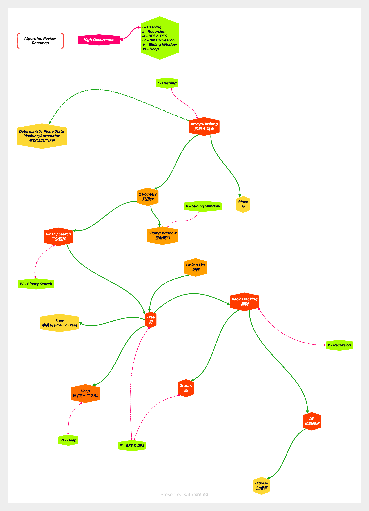

# StayCompetitiveAlgorithm
> Just staying competitive -> **[*Algorithm*]**

## Roadmap

## Naming prefix

* `1e_`
  * Easy
* `2m_`
  * Medium
* `3h_`
  * Hard

## Updating Rules

1. Update `xmind` file
2. Add new `python` files
3. Export `PGN` for `xmind`

